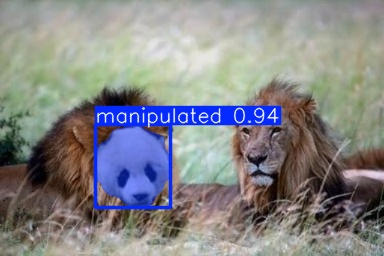
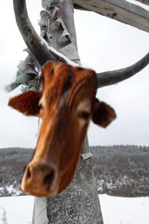
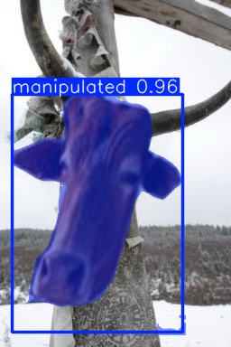

# YOLOFakeImagesDetection

This project uses the YOLO model to detect manipulations in images, such as Photoshop edits, cropping, or deepfakes.

## 🤖🔍 What is the goal of our model? 
🐱🚫🐇  _Que no te den gato por liebre_ – making sure you're not being tricked! 

<table border="1" style="border-collapse: collapse; text-align: center;">
  <tr>
    <th>Manipulated</th>
    <th>Detected</th>
  </tr>
  <tr>
    <td></td>
    <td></td>
  </tr>
  <tr>
    <td></td>
    <td></td>
  </tr>
</table>

> **Note:**  
We are using the CASIA V2 dataset [1-3], which contains 4795 images: 1701 authentic and 3274 forged/spliced. We renamed the authentic images from "AU_name_000.png" to "Au_name000.png" for convenience.

# 📌 Features

- Detects manipulated images using deep learning.
- Uses YOLO to find patterns in digital edits.
- Supports images and videos.
- Backend in Flask, web interface with HTML + TailwindCSS.

More specifically, we focused the model on solving the problem of detecting bounding boxes and subsequent segmentation of the fake regions of the image, if any.

Even more specifically, we ignore the original image from which the "fake" region comes, as it is not strictly necessary for the segmentation process. However, if the goal is a model that can also detect differences or contrast between the original and manipulated image, including the original images for such analysis could be considered for future work.

# 📂 Project Structure
```bash
(.yolofid) alejandro@pop-os:/opt/YOLOFakeImagesDetection$ tree -L 2
.
├── app.py              # Flask server for detection
├── assets              # Folder containing test images
├── config.yaml         # Project configuration file
├── datasets            # Folder containing the datasets used in the project
│   ├── custom_dataset  # Dataset formatted for YOLO training
│   │   ├── images/              # CASIA v2 images
│   │   │   ├── real/            # Authentic (original) images 
│   │   │   └── forged/          # Manipulated images
│   │   ├── masks/               # Ground truth masks for manipulated regions
│   │   │   └── forged/          # Masks corresponding to manipulated images
│   └── downloaded_dataset  # Original dataset before conversion to YOLO format
├── data.yaml           # YOLO dataset configuration file
├── LICENSE             # Project license
├── models              # Folder containing trained YOLO model weights
│   └── my_model        # Trained YOLO model
├── notebook.ipynb      # Initial exploration, dataset processing, and model training
├── output              # Detection results
│   ├── single_test     # Results for individual test images
│   └── test            # Results for batch tests
├── README.md           # Project documentation
├── requirements.txt    # List of dependencies required for the project
│── static/             # Static files (CSS, JS, images...)
│   ├── styles.css      # CSS code
│   └── scripts.js      # Javascript code
│── templates/          # HTML templates for the web interface
│   └── index.html      # HTML code
└── setup.sh            # Script to set up the project
```

# 🚀 Using the Application 

You just need to clone the project:
```bash
git clone https://github.com/agarnung/YOLOFakeImagesDetection.git && cd YOLOFakeImagesDetection
```

and set it up using the following command:
```bash
source setup.sh
```

Launch the application using the following command:
```bash
source launch_app.py
```

This will open the first available browser (firefox, chrome, chromium...) on the system with the web app.

Or, if you prefer to do it manually (stop any program that uses the default port 5000, if any, or start the server on a different port):
```bash
python3 app.py 
python3 app.py --host=127.0.0.1 --port=5000 # Or host --host=0.0.0.0 f you want it to be accessible to the entire local network
```
Then open your browser and go to `http://127.0.0.1:5000/`, now you can detect fake images online!.

## 👨‍💻 or the Developers: 🏋️‍♂️ Training a Custom Model 

If you prefer to retrain the model, instead of using the pretrained model I provide, follow the steps in the notebook for doing so (this involves creating a custom datset and training and saving a custom model); I hope you find it very useful.

Specify your configuration, both for training and testing (though testing is done from the app, there is a section in the notebook for CLI testing), in the `config.yaml` file. For both training and testing, you need to (un)comment the respective sections of this file.

# About

Here, I will gather some notes on how to start a project like this from scratch:

## 🛠️ Installation
Dependencies are generated using:
```bash
pipreqs . --force
```

This section documents a small guide for developers to create projects like this one, so it will be useful for other developers interested in it without prior knowledge, like me.

## Virtual Environment

Use a virtual environment to manage dependencies for your project, both in development and production.

What problem does a virtual environment solve? The more Python projects you have, the more likely it is that you need to work with different versions of Python libraries, or even Python itself. Newer versions of libraries for one project can break compatibility in another project.

Virtual environments are independent groups of Python libraries, one for each project. Packages installed for one project will not affect other projects or the operating system’s packages.

Python comes bundled with the `venv` module to create virtual environments [4].

## Web Interface

The frontend is built with HTML, TailwindCSS, and JavaScript. Below is a description of the `index.html` file.

    HTML: A markup language that defines the structure of the web interface. No installation is required, just a browser to interpret it.
    TailwindCSS: A CSS framework that makes designing with utility classes easier. It can be used via CDN or installed with npm.
    JavaScript: A programming language for interactivity on the web. It runs in the browser and requires no additional installation.

For TailwindCSS, if you use the content delivery network (CDN) from the HTML code, no installation is needed. By linking to the Tailwind CDN, developers can quickly add the framework to their web pages and start using its utility classes immediately. If you want more customization, you can install it with `npm install tailwindcss`.

## Flask

We use Flask for the backend of our project, a lightweight Python framework for building web applications. We use it to build an API that allows image uploads through a browser and run our model "behind the scenes."

**What basic steps are needed to create my web application?**

1. Define routes (@app.route) to handle HTTP requests.

2. Receive files via POST, process the image with YOLO, and return the results.

3. Display the results on a web interface → Use HTML + CSS + JavaScript (or similar frontend libraries) to visualize the image with its detections.

4. Return data in JSON format → To facilitate and make the integration with the interface efficient.

### Flask Installation

- Inside the virtual environment [4]:
```bash
pip install Flask
```

## Python Imaging Library (PIL)

For image handling, we will use the PIL library, or more specifically its fork Pillow, which is more portable and easier to install than OpenCV (although Ultralytics already installs it as a dependency) and suitable for rapid prototyping in Python, as it adds image processing capabilities to the Python interpreter [5].

### PIL Installation

- Inside the virtual environment [5]:
```bash
python3 -m pip install --upgrade pip
python3 -m pip install --upgrade Pillow
```

It is worth mentioning that most major Linux distributions, including Fedora, Ubuntu, and ArchLinux, also include Pillow in packages that previously contained PIL, such as `python-imaging`.

## Ultralytics

As the model for detecting fake regions, we will use one of the state-of-the-art YOLO models from Ultralytics. YOLO11, and earlier versions of YOLO from Ultralytics, are architectures gradually more refined from the original YOLO version. They are designed to be fast, accurate, and easy to use, making them an excellent choice for a wide range of object detection and tracking, instance segmentation, image classification, and pose estimation tasks.

We will use YOLO both during training via its Command Line Interface (CLI) and for inference using its Python API.

### Ultralytics Installation

- To install the Ultralytics framework, we can use pip, Conda, Docker, or clone their repository from GitHub [6]. Inside the virtual environment:
```bash
pip install ultralytics
```

We use the pre-trained model `yolov8s.pt`; it is not necessary to download it to use it from the CLI or our notebook. How do I load and validate a pretrained YOLO segmentation model? [Check this](https://github.com/ultralytics/ultralytics/blob/main/docs/en/tasks/segment.md).

## 📦 Dataset Download

If you want to retrain the model, you need to download the dataset from Kaggle, either manually or via its API with `pip install kaggle`, create an account, generate an API token with the `kaggle.json` file, and then run something like `kaggle datasets download -d boliu0/casia-v2 -p dataset/ --unzip` (see [7]).

> **Note:**  
If you need the specific datasets I used, feel free to contact me.  

_Enjoy!_

# **References**

[1] [CASIA Image Tampering Detection Evaluation Database](https://ieeexplore.ieee.org/document/6625374)

[2] [CASIA V2 in Kaggle](https://paperswithcode.com/dataset/casia-v2)

[3] [New Texture Descriptor Based on Modified Fractional Entropy for Digital Image Splicing Forgery Detection](https://www.mdpi.com/1099-4300/21/4/371)

[4] [Flask official documentation](https://flask.palletsprojects.com/en/stable/installation/)

[5] [PIL official documentation](https://pillow.readthedocs.io/en/stable/installation/basic-installation.html)

[6] [Ultralytics official documentation](https://github.com/ultralytics/ultralytics?tab=readme-ov-file)

[7] [Kaggle official documentation](https://www.kaggle.com/docs/api)

# TODO

- Separate the configuration into config_train.yaml, config_val.yaml, and config_test.yaml, with their respective data_x.yaml files, and create scripts so that there is no need to launch the notebook, and perhaps also for dataset creation.

- Allow video processing and playback from the web.

- Simplify better the requirements.txt in requirements_simple.txt to not include low-level dependencies or pack all in a Docker 
